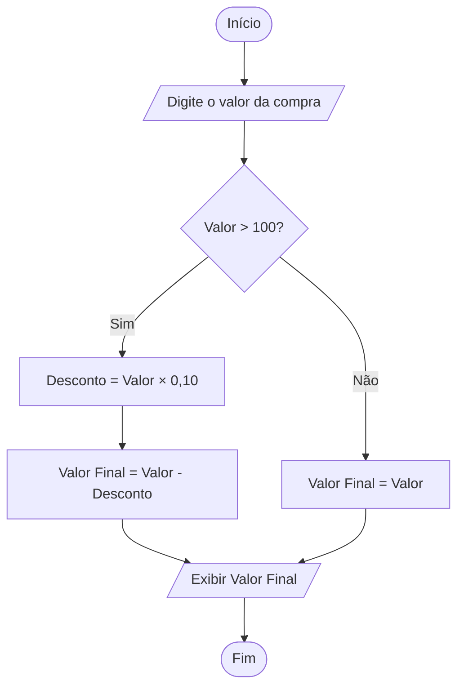

```mermaid
flowchart TD

    A([Início]) --> B[/Digite o valor da compra/]

    B --> C{Valor > 100?}

    C -->|Sim| D[Desconto = Valor × 0,10]

    D --> E[Valor Final = Valor - Desconto]

    C -->|Não| F[Valor Final = Valor]

    E --> G[/Exibir Valor Final/]

    F --> G

    G --> H([Fim])
```